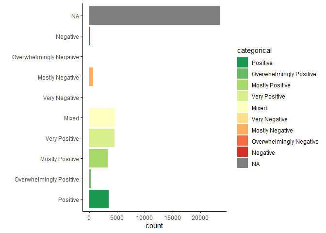
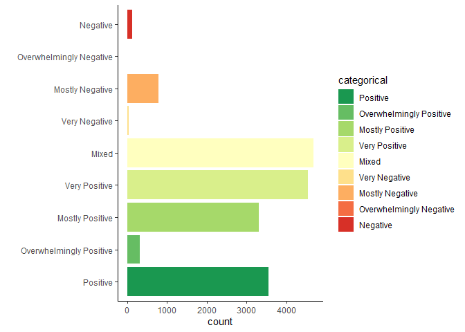
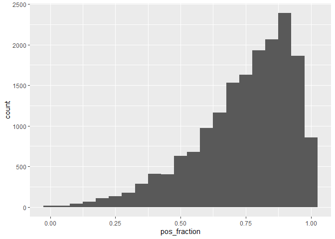
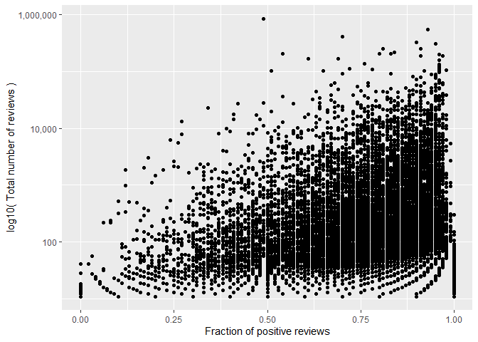
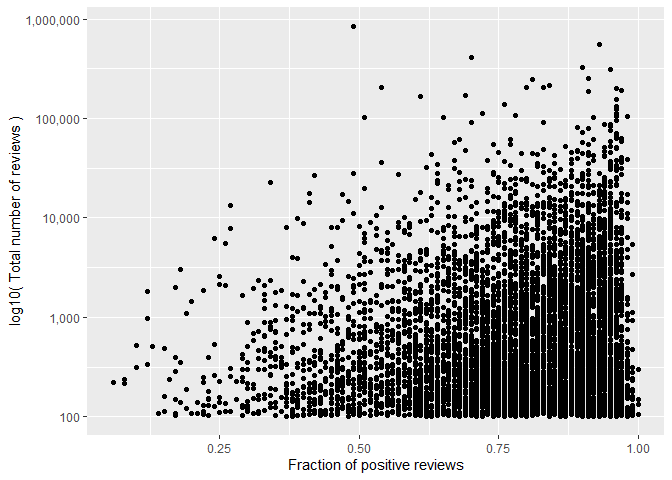
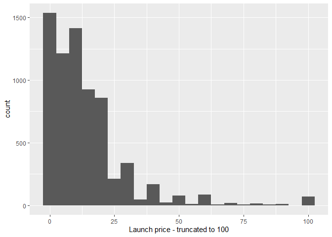
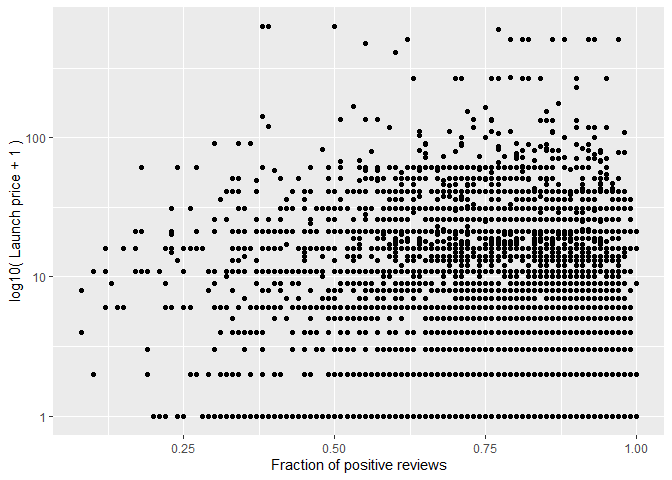

Mini Data-Analysis Deliverable 1
================

# Welcome to your (maybe) first-ever data analysis project!

And hopefully the first of many. Let’s get started:

1.  Install the [`datateachr`](https://github.com/UBC-MDS/datateachr)
    package by typing the following into your **R terminal**:

<!-- -->

    install.packages("devtools")
    devtools::install_github("UBC-MDS/datateachr")

2.  Load the packages below.

``` r
library(datateachr)
library(tidyverse)
```

    ## ── Attaching packages ─────────────────────────────────────── tidyverse 1.3.2 ──
    ## ✔ ggplot2 3.4.0      ✔ purrr   1.0.1 
    ## ✔ tibble  3.1.8      ✔ dplyr   1.0.10
    ## ✔ tidyr   1.2.1      ✔ stringr 1.5.0 
    ## ✔ readr   2.1.3      ✔ forcats 0.5.2 
    ## ── Conflicts ────────────────────────────────────────── tidyverse_conflicts() ──
    ## ✖ dplyr::filter() masks stats::filter()
    ## ✖ dplyr::lag()    masks stats::lag()

``` r
# To facilitate parsing
library(stringr)
# Nice colors
library(RColorBrewer)
# Scale axis
library(scales)
```

    ## 
    ## Attaching package: 'scales'
    ## 
    ## The following object is masked from 'package:purrr':
    ## 
    ##     discard
    ## 
    ## The following object is masked from 'package:readr':
    ## 
    ##     col_factor

3.  Make a repository in the <https://github.com/stat545ubc-2023>
    Organization. You can do this by following the steps found on canvas
    in the entry called [MDA: Create a
    repository](https://canvas.ubc.ca/courses/126199/pages/mda-create-a-repository).
    One completed, your repository should automatically be listed as
    part of the stat545ubc-2023 Organization.

# Instructions

## For Both Milestones

- Each milestone has explicit tasks. Tasks that are more challenging
  will often be allocated more points.

- Each milestone will be also graded for reproducibility, cleanliness,
  and coherence of the overall Github submission.

- While the two milestones will be submitted as independent
  deliverables, the analysis itself is a continuum - think of it as two
  chapters to a story. Each chapter, or in this case, portion of your
  analysis, should be easily followed through by someone unfamiliar with
  the content.
  [Here](https://swcarpentry.github.io/r-novice-inflammation/06-best-practices-R/)
  is a good resource for what constitutes “good code”. Learning good
  coding practices early in your career will save you hassle later on!

- The milestones will be equally weighted.

## For Milestone 1

**To complete this milestone**, edit [this very `.Rmd`
file](https://raw.githubusercontent.com/UBC-STAT/stat545.stat.ubc.ca/master/content/mini-project/mini-project-1.Rmd)
directly. Fill in the sections that are tagged with
`<!--- start your work below --->`.

**To submit this milestone**, make sure to knit this `.Rmd` file to an
`.md` file by changing the YAML output settings from
`output: html_document` to `output: github_document`. Commit and push
all of your work to the mini-analysis GitHub repository you made
earlier, and tag a release on GitHub. Then, submit a link to your tagged
release on canvas.

**Points**: This milestone is worth 36 points: 30 for your analysis, and
6 for overall reproducibility, cleanliness, and coherence of the Github
submission.

# Learning Objectives

By the end of this milestone, you should:

- Become familiar with your dataset of choosing
- Select 4 questions that you would like to answer with your data
- Generate a reproducible and clear report using R Markdown
- Become familiar with manipulating and summarizing your data in tibbles
  using `dplyr`, with a research question in mind.

# Task 1: Choose your favorite dataset

The `datateachr` package by Hayley Boyce and Jordan Bourak currently
composed of 7 semi-tidy datasets for educational purposes. Here is a
brief description of each dataset:

- *apt_buildings*: Acquired courtesy of The City of Toronto’s Open Data
  Portal. It currently has 3455 rows and 37 columns.

- *building_permits*: Acquired courtesy of The City of Vancouver’s Open
  Data Portal. It currently has 20680 rows and 14 columns.

- *cancer_sample*: Acquired courtesy of UCI Machine Learning Repository.
  It currently has 569 rows and 32 columns.

- *flow_sample*: Acquired courtesy of The Government of Canada’s
  Historical Hydrometric Database. It currently has 218 rows and 7
  columns.

- *parking_meters*: Acquired courtesy of The City of Vancouver’s Open
  Data Portal. It currently has 10032 rows and 22 columns.

- *steam_games*: Acquired courtesy of Kaggle. It currently has 40833
  rows and 21 columns.

- *vancouver_trees*: Acquired courtesy of The City of Vancouver’s Open
  Data Portal. It currently has 146611 rows and 20 columns.

**Things to keep in mind**

- We hope that this project will serve as practice for carrying our your
  own *independent* data analysis. Remember to comment your code, be
  explicit about what you are doing, and write notes in this markdown
  document when you feel that context is required. As you advance in the
  project, prompts and hints to do this will be diminished - it’ll be up
  to you!

- Before choosing a dataset, you should always keep in mind **your
  goal**, or in other ways, *what you wish to achieve with this data*.
  This mini data-analysis project focuses on *data wrangling*,
  *tidying*, and *visualization*. In short, it’s a way for you to get
  your feet wet with exploring data on your own.

And that is exactly the first thing that you will do!

1.1 **(1 point)** Out of the 7 datasets available in the `datateachr`
package, choose **4** that appeal to you based on their description.
Write your choices below:

**Note**: We encourage you to use the ones in the `datateachr` package,
but if you have a dataset that you’d really like to use, you can include
it here. But, please check with a member of the teaching team to see
whether the dataset is of appropriate complexity. Also, include a
**brief** description of the dataset here to help the teaching team
understand your data.

<!-------------------------- Start your work below ---------------------------->

1: *steam_games*  
2: *apt_buildings*  
3: *flow_sample*  
4: *vancouver_trees*

<!----------------------------------------------------------------------------->

1.2 **(6 points)** One way to narrowing down your selection is to
*explore* the datasets. Use your knowledge of dplyr to find out at least
*3* attributes about each of these datasets (an attribute is something
such as number of rows, variables, class type…). The goal here is to
have an idea of *what the data looks like*.

*Hint:* This is one of those times when you should think about the
cleanliness of your analysis. I added a single code chunk for you below,
but do you want to use more than one? Would you like to write more
comments outside of the code chunk?

<!-------------------------- Start your work below ---------------------------->

``` r
# See the name of every column in the dataset
steam_games %>%
  colnames()
```

    ##  [1] "id"                       "url"                     
    ##  [3] "types"                    "name"                    
    ##  [5] "desc_snippet"             "recent_reviews"          
    ##  [7] "all_reviews"              "release_date"            
    ##  [9] "developer"                "publisher"               
    ## [11] "popular_tags"             "game_details"            
    ## [13] "languages"                "achievements"            
    ## [15] "genre"                    "game_description"        
    ## [17] "mature_content"           "minimum_requirements"    
    ## [19] "recommended_requirements" "original_price"          
    ## [21] "discount_price"

``` r
# Visualize at a glance the range of values
steam_games %>%
  summary() %>%
  knitr::kable( )
```

|     | id            | url              | types            | name             | desc_snippet     | recent_reviews   | all_reviews      | release_date     | developer        | publisher        | popular_tags     | game_details     | languages        | achievements   | genre            | game_description | mature_content   | minimum_requirements | recommended_requirements | original_price | discount_price |
|:----|:--------------|:-----------------|:-----------------|:-----------------|:-----------------|:-----------------|:-----------------|:-----------------|:-----------------|:-----------------|:-----------------|:-----------------|:-----------------|:---------------|:-----------------|:-----------------|:-----------------|:---------------------|:-------------------------|:---------------|:---------------|
|     | Min. : 1      | Length:40833     | Length:40833     | Length:40833     | Length:40833     | Length:40833     | Length:40833     | Length:40833     | Length:40833     | Length:40833     | Length:40833     | Length:40833     | Length:40833     | Min. : 1.00    | Length:40833     | Length:40833     | Length:40833     | Length:40833         | Length:40833             | Min. : 0.0     | Min. : 0.00    |
|     | 1st Qu.:10209 | Class :character | Class :character | Class :character | Class :character | Class :character | Class :character | Class :character | Class :character | Class :character | Class :character | Class :character | Class :character | 1st Qu.: 12.00 | Class :character | Class :character | Class :character | Class :character     | Class :character         | 1st Qu.: 2.0   | 1st Qu.: 8.78  |
|     | Median :20417 | Mode :character  | Mode :character  | Mode :character  | Mode :character  | Mode :character  | Mode :character  | Mode :character  | Mode :character  | Mode :character  | Mode :character  | Mode :character  | Mode :character  | Median : 21.00 | Mode :character  | Mode :character  | Mode :character  | Mode :character      | Mode :character          | Median : 5.0   | Median : 19.98 |
|     | Mean :20417   | NA               | NA               | NA               | NA               | NA               | NA               | NA               | NA               | NA               | NA               | NA               | NA               | Mean : 77.24   | NA               | NA               | NA               | NA                   | NA                       | Mean : 53.1    | Mean : 46.82   |
|     | 3rd Qu.:30625 | NA               | NA               | NA               | NA               | NA               | NA               | NA               | NA               | NA               | NA               | NA               | NA               | 3rd Qu.: 38.00 | NA               | NA               | NA               | NA                   | NA                       | 3rd Qu.: 10.0  | 3rd Qu.: 43.92 |
|     | Max. :40833   | NA               | NA               | NA               | NA               | NA               | NA               | NA               | NA               | NA               | NA               | NA               | NA               | Max. :9821.00  | NA               | NA               | NA               | NA                   | NA                       | Max. :730640.0 | Max. :962.60   |
|     | NA            | NA               | NA               | NA               | NA               | NA               | NA               | NA               | NA               | NA               | NA               | NA               | NA               | NA’s :28639    | NA               | NA               | NA               | NA                   | NA                       | NA’s :5353     | NA’s :26290    |

``` r
# Observe the information in the first couple of rows
# Removed game description, recommended and minimum requirements for a better table output
steam_games %>%
  select(!game_description) %>%
  select(!minimum_requirements) %>%
  select(!recommended_requirements) %>%
  head(5) %>%
  knitr::kable()
```

|  id | url                                                                       | types | name                          | desc_snippet                                                                                                                                                                                                                                                                                                                | recent_reviews                                                                      | all_reviews                                                                           | release_date | developer           | publisher                               | popular_tags                                                                                                                                                                                                                    | game_details                                                                                                                 | languages                                                                                                                                                                        | achievements | genre                                                  | mature_content                                                                                                                                                                                                                         | original_price | discount_price |
|----:|:--------------------------------------------------------------------------|:------|:------------------------------|:----------------------------------------------------------------------------------------------------------------------------------------------------------------------------------------------------------------------------------------------------------------------------------------------------------------------------|:------------------------------------------------------------------------------------|:--------------------------------------------------------------------------------------|:-------------|:--------------------|:----------------------------------------|:--------------------------------------------------------------------------------------------------------------------------------------------------------------------------------------------------------------------------------|:-----------------------------------------------------------------------------------------------------------------------------|:---------------------------------------------------------------------------------------------------------------------------------------------------------------------------------|-------------:|:-------------------------------------------------------|:---------------------------------------------------------------------------------------------------------------------------------------------------------------------------------------------------------------------------------------|---------------:|---------------:|
|   1 | <https://store.steampowered.com/app/379720/DOOM/>                         | app   | DOOM                          | Now includes all three premium DLC packs (Unto the Evil, Hell Followed, and Bloodfall), maps, modes, and weapons, as well as all feature updates including Arcade Mode, Photo Mode, and the latest Update 6.66, which brings further multiplayer improvements as well as revamps multiplayer progression.                   | Very Positive,(554),- 89% of the 554 user reviews in the last 30 days are positive. | Very Positive,(42,550),- 92% of the 42,550 user reviews for this game are positive.   | May 12, 2016 | id Software         | Bethesda Softworks,Bethesda Softworks   | FPS,Gore,Action,Demons,Shooter,First-Person,Great Soundtrack,Multiplayer,Singleplayer,Fast-Paced,Sci-fi,Horror,Classic,Atmospheric,Difficult,Blood,Remake,Zombies,Co-op,Memes                                                   | Single-player,Multi-player,Co-op,Steam Achievements,Steam Trading Cards,Partial Controller Support,Steam Cloud               | English,French,Italian,German,Spanish - Spain,Japanese,Polish,Portuguese - Brazil,Russian,Traditional Chinese                                                                    |           54 | Action                                                 | NA                                                                                                                                                                                                                                     |          19.99 |          14.99 |
|   2 | <https://store.steampowered.com/app/578080/PLAYERUNKNOWNS_BATTLEGROUNDS/> | app   | PLAYERUNKNOWN’S BATTLEGROUNDS | PLAYERUNKNOWN’S BATTLEGROUNDS is a battle royale shooter that pits 100 players against each other in a struggle for survival. Gather supplies and outwit your opponents to become the last person standing.                                                                                                                 | Mixed,(6,214),- 49% of the 6,214 user reviews in the last 30 days are positive.     | Mixed,(836,608),- 49% of the 836,608 user reviews for this game are positive.         | Dec 21, 2017 | PUBG Corporation    | PUBG Corporation,PUBG Corporation       | Survival,Shooter,Multiplayer,Battle Royale,PvP,FPS,Third-Person Shooter,Action,Online Co-Op,Tactical,Co-op,First-Person,Early Access,Strategy,Competitive,Third Person,Team-Based,Difficult,Simulation,Stealth                  | Multi-player,Online Multi-Player,Stats                                                                                       | English,Korean,Simplified Chinese,French,German,Spanish - Spain,Arabic,Japanese,Polish,Portuguese,Russian,Turkish,Thai,Italian,Portuguese - Brazil,Traditional Chinese,Ukrainian |           37 | Action,Adventure,Massively Multiplayer                 | Mature Content Description The developers describe the content like this: This Game may contain content not appropriate for all ages, or may not be appropriate for viewing at work: Frequent Violence or Gore, General Mature Content |          29.99 |             NA |
|   3 | <https://store.steampowered.com/app/637090/BATTLETECH/>                   | app   | BATTLETECH                    | Take command of your own mercenary outfit of ’Mechs and the MechWarriors that pilot them, struggling to stay afloat as you find yourself drawn into a brutal interstellar civil war.                                                                                                                                        | Mixed,(166),- 54% of the 166 user reviews in the last 30 days are positive.         | Mostly Positive,(7,030),- 71% of the 7,030 user reviews for this game are positive.   | Apr 24, 2018 | Harebrained Schemes | Paradox Interactive,Paradox Interactive | Mechs,Strategy,Turn-Based,Turn-Based Tactics,Sci-fi,Turn-Based Strategy,Tactical,Singleplayer,Robots,RPG,Action,Multiplayer,Futuristic,Character Customization,Management,Adventure,Space,Story Rich,Great Soundtrack,Difficult | Single-player,Multi-player,Online Multi-Player,Cross-Platform Multiplayer,Steam Achievements,Steam Trading Cards,Steam Cloud | English,French,German,Russian                                                                                                                                                    |          128 | Action,Adventure,Strategy                              | NA                                                                                                                                                                                                                                     |          39.99 |             NA |
|   4 | <https://store.steampowered.com/app/221100/DayZ/>                         | app   | DayZ                          | The post-soviet country of Chernarus is struck by an unknown virus, turning the majority population into frenzied infected. Fighting over resources has bred a hostile mentality among survivors, driving what’s left of humanity to collapse. You are one of the few immune to the virus - how far will you go to survive? | Mixed,(932),- 57% of the 932 user reviews in the last 30 days are positive.         | Mixed,(167,115),- 61% of the 167,115 user reviews for this game are positive.         | Dec 13, 2018 | Bohemia Interactive | Bohemia Interactive,Bohemia Interactive | Survival,Zombies,Open World,Multiplayer,PvP,Massively Multiplayer,Action,Early Access,Simulation,FPS,Post-apocalyptic,Survival Horror,Shooter,Sandbox,Adventure,Indie,Co-op,Atmospheric,Horror,Military                         | Multi-player,Online Multi-Player,Steam Workshop,Steam Cloud,Valve Anti-Cheat enabled                                         | English,French,Italian,German,Spanish - Spain,Czech,Russian,Simplified Chinese,Traditional Chinese                                                                               |           NA | Action,Adventure,Massively Multiplayer                 | NA                                                                                                                                                                                                                                     |          44.99 |             NA |
|   5 | <https://store.steampowered.com/app/8500/EVE_Online/>                     | app   | EVE Online                    | EVE Online is a community-driven spaceship MMO where players can play free, choosing their own path from countless options. Experience space exploration, immense PvP and PvE battles, mining, industry and a thriving player economy in an ever-expanding sandbox.                                                         | Mixed,(287),- 54% of the 287 user reviews in the last 30 days are positive.         | Mostly Positive,(11,481),- 74% of the 11,481 user reviews for this game are positive. | May 6, 2003  | CCP                 | CCP,CCP                                 | Space,Massively Multiplayer,Sci-fi,Sandbox,MMORPG,Open World,RPG,PvP,Multiplayer,Free to Play,Economy,Strategy,Space Sim,Simulation,Action,Difficult,Tactical,Capitalism,PvE,Atmospheric                                        | Multi-player,Online Multi-Player,MMO,Co-op,Online Co-op,Steam Trading Cards                                                  | English,German,Russian,French                                                                                                                                                    |           NA | Action,Free to Play,Massively Multiplayer,RPG,Strategy | NA                                                                                                                                                                                                                                     |           0.00 |             NA |

``` r
# See the name of every column in the dataset
apt_buildings %>%
  colnames()
```

    ##  [1] "id"                               "air_conditioning"                
    ##  [3] "amenities"                        "balconies"                       
    ##  [5] "barrier_free_accessibilty_entr"   "bike_parking"                    
    ##  [7] "exterior_fire_escape"             "fire_alarm"                      
    ##  [9] "garbage_chutes"                   "heating_type"                    
    ## [11] "intercom"                         "laundry_room"                    
    ## [13] "locker_or_storage_room"           "no_of_elevators"                 
    ## [15] "parking_type"                     "pets_allowed"                    
    ## [17] "prop_management_company_name"     "property_type"                   
    ## [19] "rsn"                              "separate_gas_meters"             
    ## [21] "separate_hydro_meters"            "separate_water_meters"           
    ## [23] "site_address"                     "sprinkler_system"                
    ## [25] "visitor_parking"                  "ward"                            
    ## [27] "window_type"                      "year_built"                      
    ## [29] "year_registered"                  "no_of_storeys"                   
    ## [31] "emergency_power"                  "non-smoking_building"            
    ## [33] "no_of_units"                      "no_of_accessible_parking_spaces" 
    ## [35] "facilities_available"             "cooling_room"                    
    ## [37] "no_barrier_free_accessible_units"

``` r
# Visualize at a glance the range of values
apt_buildings %>%
  summary() %>%
  knitr::kable()
```

|     | id            | air_conditioning | amenities        | balconies        | barrier_free_accessibilty_entr | bike_parking     | exterior_fire_escape | fire_alarm       | garbage_chutes   | heating_type     | intercom         | laundry_room     | locker_or_storage_room | no_of_elevators | parking_type     | pets_allowed     | prop_management_company_name | property_type    | rsn             | separate_gas_meters | separate_hydro_meters | separate_water_meters | site_address     | sprinkler_system | visitor_parking  | ward             | window_type      | year_built   | year_registered | no_of_storeys  | emergency_power  | non-smoking_building | no_of_units     | no_of_accessible_parking_spaces | facilities_available | cooling_room     | no_barrier_free_accessible_units |
|:----|:--------------|:-----------------|:-----------------|:-----------------|:-------------------------------|:-----------------|:---------------------|:-----------------|:-----------------|:-----------------|:-----------------|:-----------------|:-----------------------|:----------------|:-----------------|:-----------------|:-----------------------------|:-----------------|:----------------|:--------------------|:----------------------|:----------------------|:-----------------|:-----------------|:-----------------|:-----------------|:-----------------|:-------------|:----------------|:---------------|:-----------------|:---------------------|:----------------|:--------------------------------|:---------------------|:-----------------|:---------------------------------|
|     | Min. :10359   | Length:3455      | Length:3455      | Length:3455      | Length:3455                    | Length:3455      | Length:3455          | Length:3455      | Length:3455      | Length:3455      | Length:3455      | Length:3455      | Length:3455            | Min. : 0.000    | Length:3455      | Length:3455      | Length:3455                  | Length:3455      | Min. :4152554   | Length:3455         | Length:3455           | Length:3455           | Length:3455      | Length:3455      | Length:3455      | Length:3455      | Length:3455      | Min. :1805   | Min. :2017      | Min. : 0.000   | Length:3455      | Length:3455          | Min. : 0.00     | Min. : 0.000                    | Length:3455          | Length:3455      | Min. : 0.000                     |
|     | 1st Qu.:11222 | Class :character | Class :character | Class :character | Class :character               | Class :character | Class :character     | Class :character | Class :character | Class :character | Class :character | Class :character | Class :character       | 1st Qu.: 0.000  | Class :character | Class :character | Class :character             | Class :character | 1st Qu.:4153682 | Class :character    | Class :character      | Class :character      | Class :character | Class :character | Class :character | Class :character | Class :character | 1st Qu.:1955 | 1st Qu.:2017    | 1st Qu.: 3.000 | Class :character | Class :character     | 1st Qu.: 25.00  | 1st Qu.: 0.000                  | Class :character     | Class :character | 1st Qu.: 0.000                   |
|     | Median :12086 | Mode :character  | Mode :character  | Mode :character  | Mode :character                | Mode :character  | Mode :character      | Mode :character  | Mode :character  | Mode :character  | Mode :character  | Mode :character  | Mode :character        | Median : 1.000  | Mode :character  | Mode :character  | Mode :character              | Mode :character  | Median :4154598 | Mode :character     | Mode :character       | Mode :character       | Mode :character  | Mode :character  | Mode :character  | Mode :character  | Mode :character  | Median :1962 | Median :2017    | Median : 5.000 | Mode :character  | Mode :character      | Median : 52.00  | Median : 1.000                  | Mode :character      | Mode :character  | Median : 0.000                   |
|     | Mean :12086   | NA               | NA               | NA               | NA                             | NA               | NA                   | NA               | NA               | NA               | NA               | NA               | NA                     | Mean : 1.208    | NA               | NA               | NA                           | NA               | Mean :4167867   | NA                  | NA                    | NA                    | NA               | NA               | NA               | NA               | NA               | Mean :1962   | Mean :2017      | Mean : 7.738   | NA               | NA                   | Mean : 91.09    | Mean : 6.559                    | NA                   | NA               | Mean : 9.408                     |
|     | 3rd Qu.:12950 | NA               | NA               | NA               | NA                             | NA               | NA                   | NA               | NA               | NA               | NA               | NA               | NA                     | 3rd Qu.: 2.000  | NA               | NA               | NA                           | NA               | 3rd Qu.:4155538 | NA                  | NA                    | NA                    | NA               | NA               | NA               | NA               | NA               | 3rd Qu.:1970 | 3rd Qu.:2017    | 3rd Qu.:10.000 | NA               | NA                   | 3rd Qu.: 124.00 | 3rd Qu.: 5.000                  | NA                   | NA               | 3rd Qu.: 1.000                   |
|     | Max. :13813   | NA               | NA               | NA               | NA                             | NA               | NA                   | NA               | NA               | NA               | NA               | NA               | NA                     | Max. :32.000    | NA               | NA               | NA                           | NA               | Max. :4716349   | NA                  | NA                    | NA                    | NA               | NA               | NA               | NA               | NA               | Max. :2019   | Max. :2020      | Max. :51.000   | NA               | NA                   | Max. :4111.00   | Max. :340.000                   | NA                   | NA               | Max. :474.000                    |
|     | NA            | NA               | NA               | NA               | NA                             | NA               | NA                   | NA               | NA               | NA               | NA               | NA               | NA                     | NA’s :5         | NA               | NA               | NA                           | NA               | NA              | NA                  | NA                    | NA                    | NA               | NA               | NA               | NA               | NA               | NA’s :13     | NA’s :89        | NA             | NA               | NA                   | NA              | NA’s :123                       | NA                   | NA               | NA’s :154                        |

``` r
# Observe the information in the first couple of rows
apt_buildings %>%
  head(5) %>%
  knitr::kable()
```

|    id | air_conditioning | amenities              | balconies | barrier_free_accessibilty_entr | bike_parking                                        | exterior_fire_escape | fire_alarm | garbage_chutes | heating_type | intercom | laundry_room | locker_or_storage_room | no_of_elevators | parking_type                                                         | pets_allowed | prop_management_company_name | property_type |     rsn | separate_gas_meters | separate_hydro_meters | separate_water_meters | site_address        | sprinkler_system | visitor_parking | ward | window_type | year_built | year_registered | no_of_storeys | emergency_power | non-smoking_building | no_of_units | no_of_accessible_parking_spaces | facilities_available | cooling_room | no_barrier_free_accessible_units |
|------:|:-----------------|:-----------------------|:----------|:-------------------------------|:----------------------------------------------------|:---------------------|:-----------|:---------------|:-------------|:---------|:-------------|:-----------------------|----------------:|:---------------------------------------------------------------------|:-------------|:-----------------------------|:--------------|--------:|:--------------------|:----------------------|:----------------------|:--------------------|:-----------------|:----------------|:-----|:------------|-----------:|----------------:|--------------:|:----------------|:---------------------|------------:|--------------------------------:|:---------------------|:-------------|---------------------------------:|
| 10359 | NONE             | Outdoor rec facilities | YES       | YES                            | 0 indoor parking spots and 10 outdoor parking spots | NO                   | YES        | YES            | HOT WATER    | YES      | YES          | NO                     |               3 | Underground Garage , Garage accessible thru buildg                   | YES          | NA                           | PRIVATE       | 4154812 | NO                  | YES                   | NO                    | 65 FOREST MANOR RD  | YES              | PAID            | 17   | DOUBLE PANE |       1967 |            2017 |            17 | NO              | YES                  |         218 |                               8 | Recycling bins       | NO           |                                2 |
| 10360 | NONE             | Outdoor pool           | YES       | NO                             | 0 indoor parking spots and 34 outdoor parking spots | NO                   | YES        | YES            | HOT WATER    | YES      | YES          | YES                    |               3 | Underground Garage , Garage accessible thru buildg , Surface Parking | YES          | SCHICKEDANZ BROS. PROPERTIES | PRIVATE       | 4154815 | NO                  | YES                   | NO                    | 70 CLIPPER RD       | YES              | FREE            | 17   | DOUBLE PANE |       1970 |            2017 |            14 | YES             | NO                   |         206 |                              10 | Green Bin / Organics | NO           |                                0 |
| 10361 | NONE             | NA                     | YES       | NO                             | Not Available                                       | NO                   | YES        | NO             | HOT WATER    | YES      | YES          | YES                    |               0 | Underground Garage , Garage accessible thru buildg , Surface Parking | YES          | NA                           | PRIVATE       | 4155295 | NO                  | YES                   | NO                    | 2651 BLOOR ST W     | NO               | UNAVAILABLE     | 03   | DOUBLE PANE |       1927 |            2017 |             4 | NO              | YES                  |          34 |                              20 | Green Bin / Organics | NO           |                                0 |
| 10362 | NONE             | NA                     | YES       | YES                            | Not Available                                       | YES                  | YES        | NO             | HOT WATER    | YES      | YES          | YES                    |               1 | Ground Level Garage , Surface Parking                                | YES          | FREIMAN INVESTMENTS          | PRIVATE       | 4155309 | NO                  | YES                   | NO                    | 22 BURNHAMTHORPE RD | YES              | UNAVAILABLE     | 03   | DOUBLE PANE |       1959 |            2017 |             5 | NO              | YES                  |          42 |                              42 | Green Bin / Organics | NO           |                               42 |
| 10363 | NONE             | NA                     | NO        | NO                             | 12 indoor parking spots and 0 outdoor parking spots | NO                   | YES        | NO             | HOT WATER    | YES      | YES          | NO                     |               0 | Underground Garage , Garage accessible thru buildg , Surface Parking | YES          | NA                           | PRIVATE       | 4155318 | NO                  | YES                   | NO                    | 18 ANGLESEY BLVD    | NO               | UNAVAILABLE     | 02   | DOUBLE PANE |       1943 |            2017 |             4 | NO              | YES                  |          25 |                              12 | Green Bin / Organics | NO           |                                0 |

``` r
# See the name of every column in the dataset
flow_sample %>%
  colnames()
```

    ## [1] "station_id"   "year"         "extreme_type" "month"        "day"         
    ## [6] "flow"         "sym"

``` r
# Visualize at a glance the range of values
flow_sample %>%
  summary() %>%
  knitr::kable()
```

|     | station_id       | year         | extreme_type     | month          | day           | flow           | sym              |
|:----|:-----------------|:-------------|:-----------------|:---------------|:--------------|:---------------|:-----------------|
|     | Length:218       | Min. :1909   | Length:218       | Min. : 1.000   | Min. : 1.00   | Min. : 3.62    | Length:218       |
|     | Class :character | 1st Qu.:1936 | Class :character | 1st Qu.: 3.000 | 1st Qu.: 8.00 | 1st Qu.: 6.18  | Class :character |
|     | Mode :character  | Median :1963 | Mode :character  | Median : 6.000 | Median :17.00 | Median :114.00 | Mode :character  |
|     | NA               | Mean :1963   | NA               | Mean : 5.046   | Mean :16.24   | Mean :110.13   | NA               |
|     | NA               | 3rd Qu.:1990 | NA               | 3rd Qu.: 6.000 | 3rd Qu.:25.00 | 3rd Qu.:204.25 | NA               |
|     | NA               | Max. :2018   | NA               | Max. :12.000   | Max. :31.00   | Max. :466.00   | NA               |
|     | NA               | NA           | NA               | NA’s :2        | NA’s :2       | NA’s :2        | NA               |

``` r
# Observe the information in the first couple of rows
flow_sample %>%
  head(5) %>%
  knitr::kable()
```

| station_id | year | extreme_type | month | day | flow | sym |
|:-----------|-----:|:-------------|------:|----:|-----:|:----|
| 05BB001    | 1909 | maximum      |     7 |   7 |  314 | NA  |
| 05BB001    | 1910 | maximum      |     6 |  12 |  230 | NA  |
| 05BB001    | 1911 | maximum      |     6 |  14 |  264 | NA  |
| 05BB001    | 1912 | maximum      |     8 |  25 |  174 | NA  |
| 05BB001    | 1913 | maximum      |     6 |  11 |  232 | NA  |

``` r
# See the name of every column in the dataset
vancouver_trees %>%
  colnames()
```

    ##  [1] "tree_id"            "civic_number"       "std_street"        
    ##  [4] "genus_name"         "species_name"       "cultivar_name"     
    ##  [7] "common_name"        "assigned"           "root_barrier"      
    ## [10] "plant_area"         "on_street_block"    "on_street"         
    ## [13] "neighbourhood_name" "street_side_name"   "height_range_id"   
    ## [16] "diameter"           "curb"               "date_planted"      
    ## [19] "longitude"          "latitude"

``` r
# Visualize at a glance the range of values
vancouver_trees %>%
  summary() %>%
  knitr::kable()
```

|     | tree_id        | civic_number  | std_street       | genus_name       | species_name     | cultivar_name    | common_name      | assigned         | root_barrier     | plant_area       | on_street_block | on_street        | neighbourhood_name | street_side_name | height_range_id | diameter       | curb             | date_planted       | longitude      | latitude      |
|:----|:---------------|:--------------|:-----------------|:-----------------|:-----------------|:-----------------|:-----------------|:-----------------|:-----------------|:-----------------|:----------------|:-----------------|:-------------------|:-----------------|:----------------|:---------------|:-----------------|:-------------------|:---------------|:--------------|
|     | Min. : 12      | Min. : 0      | Length:146611    | Length:146611    | Length:146611    | Length:146611    | Length:146611    | Length:146611    | Length:146611    | Length:146611    | Min. : 0        | Length:146611    | Length:146611      | Length:146611    | Min. : 0.000    | Min. : 0.00    | Length:146611    | Min. :1989-10-27   | Min. :-123.2   | Min. :49.20   |
|     | 1st Qu.: 65464 | 1st Qu.: 1306 | Class :character | Class :character | Class :character | Class :character | Class :character | Class :character | Class :character | Class :character | 1st Qu.:1300    | Class :character | Class :character   | Class :character | 1st Qu.: 1.000  | 1st Qu.: 3.50  | Class :character | 1st Qu.:1998-02-23 | 1st Qu.:-123.1 | 1st Qu.:49.23 |
|     | Median :134903 | Median : 2604 | Mode :character  | Mode :character  | Mode :character  | Mode :character  | Mode :character  | Mode :character  | Mode :character  | Mode :character  | Median :2600    | Mode :character  | Mode :character    | Mode :character  | Median : 2.000  | Median : 9.00  | Mode :character  | Median :2004-01-28 | Median :-123.1 | Median :49.25 |
|     | Mean :131892   | Mean : 2937   | NA               | NA               | NA               | NA               | NA               | NA               | NA               | NA               | Mean :2909      | NA               | NA                 | NA               | Mean : 2.627    | Mean : 11.49   | NA               | Mean :2004-04-07   | Mean :-123.1   | Mean :49.25   |
|     | 3rd Qu.:194450 | 3rd Qu.: 4005 | NA               | NA               | NA               | NA               | NA               | NA               | NA               | NA               | 3rd Qu.:4000    | NA               | NA                 | NA               | 3rd Qu.: 4.000  | 3rd Qu.: 16.50 | NA               | 3rd Qu.:2010-03-02 | 3rd Qu.:-123.1 | 3rd Qu.:49.26 |
|     | Max. :266203   | Max. :17888   | NA               | NA               | NA               | NA               | NA               | NA               | NA               | NA               | Max. :9900      | NA               | NA                 | NA               | Max. :10.000    | Max. :435.00   | NA               | Max. :2019-07-03   | Max. :-123.0   | Max. :49.29   |
|     | NA             | NA            | NA               | NA               | NA               | NA               | NA               | NA               | NA               | NA               | NA              | NA               | NA                 | NA               | NA              | NA             | NA               | NA’s :76548        | NA’s :22771    | NA’s :22771   |

``` r
# Observe the information in the first couple of rows
vancouver_trees %>%
  head(5) %>%
  knitr::kable()
```

| tree_id | civic_number | std_street | genus_name | species_name | cultivar_name   | common_name         | assigned | root_barrier | plant_area | on_street_block | on_street  | neighbourhood_name       | street_side_name | height_range_id | diameter | curb | date_planted | longitude | latitude |
|--------:|-------------:|:-----------|:-----------|:-------------|:----------------|:--------------------|:---------|:-------------|:-----------|----------------:|:-----------|:-------------------------|:-----------------|----------------:|---------:|:-----|:-------------|----------:|---------:|
|  149556 |          494 | W 58TH AV  | ULMUS      | AMERICANA    | BRANDON         | BRANDON ELM         | N        | N            | N          |             400 | W 58TH AV  | MARPOLE                  | EVEN             |               2 |       10 | N    | 1999-01-13   | -123.1161 | 49.21776 |
|  149563 |          450 | W 58TH AV  | ZELKOVA    | SERRATA      | NA              | JAPANESE ZELKOVA    | N        | N            | N          |             400 | W 58TH AV  | MARPOLE                  | EVEN             |               4 |       10 | N    | 1996-05-31   | -123.1147 | 49.21776 |
|  149579 |         4994 | WINDSOR ST | STYRAX     | JAPONICA     | NA              | JAPANESE SNOWBELL   | N        | N            | 4          |            4900 | WINDSOR ST | KENSINGTON-CEDAR COTTAGE | EVEN             |               3 |        4 | Y    | 1993-11-22   | -123.0846 | 49.23938 |
|  149590 |          858 | E 39TH AV  | FRAXINUS   | AMERICANA    | AUTUMN APPLAUSE | AUTUMN APPLAUSE ASH | Y        | N            | 4          |             800 | E 39TH AV  | KENSINGTON-CEDAR COTTAGE | EVEN             |               4 |       18 | Y    | 1996-04-29   | -123.0870 | 49.23469 |
|  149604 |         5032 | WINDSOR ST | ACER       | CAMPESTRE    | NA              | HEDGE MAPLE         | N        | N            | 4          |            5000 | WINDSOR ST | KENSINGTON-CEDAR COTTAGE | EVEN             |               2 |        9 | Y    | 1993-12-17   | -123.0846 | 49.23894 |

<!----------------------------------------------------------------------------->

1.3 **(1 point)** Now that you’ve explored the 4 datasets that you were
initially most interested in, let’s narrow it down to 1. What lead you
to choose this one? Briefly explain your choice below.

<!-------------------------- Start your work below ---------------------------->

I’m keeping my first choice of *steam_games*, It would be a nice change
to work with something unrelated to biology. I think the main challenge
when analyzing this dataset is the parsing of the information in each
column. However, there are fields with a very clear structure which will
make the task easier.

<!----------------------------------------------------------------------------->

1.4 **(2 points)** Time for a final decision! Going back to the
beginning, it’s important to have an *end goal* in mind. For example, if
I had chosen the `titanic` dataset for my project, I might’ve wanted to
explore the relationship between survival and other variables. Try to
think of 1 research question that you would want to answer with your
dataset. Note it down below.

<!-------------------------- Start your work below ---------------------------->

I would like to explore if there is any association relationship between
game ratings and variables such as:

- game_details: If the game online, multi-player or single-player

- genre

- developer

<!----------------------------------------------------------------------------->

# Important note

Read Tasks 2 and 3 *fully* before starting to complete either of them.
Probably also a good point to grab a coffee to get ready for the fun
part!

This project is semi-guided, but meant to be *independent*. For this
reason, you will complete tasks 2 and 3 below (under the **START HERE**
mark) as if you were writing your own exploratory data analysis report,
and this guidance never existed! Feel free to add a brief introduction
section to your project, format the document with markdown syntax as you
deem appropriate, and structure the analysis as you deem appropriate. If
you feel lost, you can find a sample data analysis
[here](https://www.kaggle.com/headsortails/tidy-titarnic) to have a
better idea. However, bear in mind that it is **just an example** and
you will not be required to have that level of complexity in your
project.

# Task 2: Exploring your dataset

If we rewind and go back to the learning objectives, you’ll see that by
the end of this deliverable, you should have formulated *4* research
questions about your data that you may want to answer during your
project. However, it may be handy to do some more exploration on your
dataset of choice before creating these questions - by looking at the
data, you may get more ideas. **Before you start this task, read all
instructions carefully until you reach START HERE under Task 3**.

2.1 **(12 points)** Complete *4 out of the following 8 exercises* to
dive deeper into your data. All datasets are different and therefore,
not all of these tasks may make sense for your data - which is why you
should only answer *4*.

Make sure that you’re using dplyr and ggplot2 rather than base R for
this task. Outside of this project, you may find that you prefer using
base R functions for certain tasks, and that’s just fine! But part of
this project is for you to practice the tools we learned in class, which
is dplyr and ggplot2.

1.  Plot the distribution of a numeric variable.
2.  **Create a new variable based on other variables in your data (only
    if it makes sense)**
3.  **Investigate how many missing values there are per variable. Can
    you find a way to plot this?**
4.  **Explore the relationship between 2 variables in a plot.**
5.  Filter observations in your data according to your own criteria.
    Think of what you’d like to explore - again, if this was the
    `titanic` dataset, I may want to narrow my search down to passengers
    born in a particular year…
6.  Use a boxplot to look at the frequency of different observations
    within a single variable. You can do this for more than one variable
    if you wish!
7.  **Make a new tibble with a subset of your data, with variables and
    observations that you are interested in exploring.**
8.  Use a density plot to explore any of your variables (that are
    suitable for this type of plot).

2.2 **(4 points)** For each of the 4 exercises that you complete,
provide a *brief explanation* of why you chose that exercise in relation
to your data (in other words, why does it make sense to do that?), and
sufficient comments for a reader to understand your reasoning and code.

<!-------------------------- Start your work below ---------------------------->

### Data pre-processing

The first goal is to observe the variability of the review score. If all
reviews are too homogeneous, it would be difficult to associate this
variable with any other. For this reason, I will create several new
columns as follow:

- Categorical rating: Mixed, Good, etc

- Fraction of positive reviews: Convert the percentage to a fraction for
  easier handling

- Total number of reviews: Extract the total number of reviews

- Number of positive reviews: Multiply the fraction by the total number
  of reviews

I will focus on “all_reviews” since it will be a more fair comparison
for games that have not had a lot of recent reviews. By doing this, I
acknowledge that some games rating can change overtime. I don’t know how
frequent this trend is, but this selection seemed like the “lesser
evil”.

``` r
reviews_data <- steam_games %>%
  select(all_reviews) %>%
  # Extract possible category choices
  mutate(categorical = str_replace(all_reviews, ",\\(.+", "")) %>%
  # Extract percentage of positive reviews and convert to fraction
  mutate(pos_fraction = str_extract(all_reviews, "[0-9]+%")) %>%
  mutate(pos_fraction = as.numeric(str_replace(pos_fraction, "%", ""))/100) %>%
  # Extract the total number of reviews
  mutate(total_reviews = str_extract(all_reviews, "of the .+ user")) %>%
  mutate(total_reviews = str_replace(total_reviews, "of the ", "")) %>%
  mutate(total_reviews = str_replace(total_reviews, " user", "")) %>%
  mutate(total_reviews = as.numeric(str_replace(total_reviews, ",", "")))
```

    ## Warning in mask$eval_all_mutate(quo): NAs introducidos por coerción

``` r
# Visualize what other stuff got into the categorical variable
unique(reviews_data$categorical)
```

    ##  [1] "Very Positive"                                              
    ##  [2] "Mixed"                                                      
    ##  [3] "Mostly Positive"                                            
    ##  [4] "NaN"                                                        
    ##  [5] "Overwhelmingly Positive"                                    
    ##  [6] "7 user reviews,- Need more user reviews to generate a score"
    ##  [7] "Positive"                                                   
    ##  [8] NA                                                           
    ##  [9] "1 user reviews,- Need more user reviews to generate a score"
    ## [10] "Mostly Negative"                                            
    ## [11] "5 user reviews,- Need more user reviews to generate a score"
    ## [12] "3 user reviews,- Need more user reviews to generate a score"
    ## [13] "2 user reviews,- Need more user reviews to generate a score"
    ## [14] "4 user reviews,- Need more user reviews to generate a score"
    ## [15] "9 user reviews,- Need more user reviews to generate a score"
    ## [16] "6 user reviews,- Need more user reviews to generate a score"
    ## [17] "8 user reviews,- Need more user reviews to generate a score"
    ## [18] "Negative"                                                   
    ## [19] "Very Negative"                                              
    ## [20] "Overwhelmingly Negative"

``` r
# Select the relevant categories
valid_categories <- unique(reviews_data$categorical)[c(7,5,3,1,2,19,10,20,18)]
# Final format
reviews_data <- reviews_data %>%
  # Extract low user-reviews and assign it to the corresponding variable
  mutate(total_reviews = ifelse(str_detect(categorical, "user reviews"),
                                str_extract(categorical, "^[0-9]+"),
                                total_reviews)) %>%
  # Conserve valid categories
  mutate(categorical = factor(categorical, levels = valid_categories)) %>%
  mutate(total_reviews = as.numeric(total_reviews)) %>%
  # Calculate number of positive reviews, rounded up
  mutate(pos_reviews = ceiling(pos_fraction * total_reviews)) %>%
  select(!all_reviews)

reviews_data %>%
  head() %>%
  knitr::kable()
```

| categorical     | pos_fraction | total_reviews | pos_reviews |
|:----------------|-------------:|--------------:|------------:|
| Very Positive   |         0.92 |         42550 |       39146 |
| Mixed           |         0.49 |        836608 |      409938 |
| Mostly Positive |         0.71 |          7030 |        4992 |
| Mixed           |         0.61 |        167115 |      101941 |
| Mostly Positive |         0.74 |         11481 |        8496 |
| NA              |           NA |            NA |          NA |

### Data visualization

I will plot the frequency of the categorical rating across all games:

``` r
category_colors <- brewer.pal(9, "RdYlGn")[seq(9,1)]

reviews_data %>%
  ggplot(aes(x = categorical, fill = categorical)) +
  geom_bar() +
  coord_flip() +
  scale_fill_manual(values = category_colors)+
  theme_classic() +
  labs(x = "")
```

<!-- -->

Since there is a lot of NA values, I repeated the same visualization but
now removing the NAs

``` r
reviews_data %>%
  na.omit() %>%
  ggplot(aes(x = categorical, fill = categorical)) +
  geom_bar() +
  coord_flip() +
  scale_fill_manual(values = category_colors)+
  theme_classic() +
  labs(x = "")
```

<!-- -->

I also visualized the distribution of the fraction of positive reviews.

``` r
reviews_data %>%
  ggplot(aes(x = pos_fraction)) +
  geom_histogram(binwidth = 0.05)
```

    ## Warning: Removed 23470 rows containing non-finite values (`stat_bin()`).

<!-- -->

Finally I observed the relationship between number of reviews and
fraction of positive reviews. Since having few reviews in general can
artificially increase the effect of negative reviews.

``` r
reviews_data %>%
  na.omit() %>%
  ggplot(aes(x = pos_fraction, y = total_reviews + 1)) +
  geom_point() +
  scale_y_continuous(trans = "log10", labels = comma) +
  labs(x = "Fraction of positive reviews", y = "log10( Total number of reviews )")
```

<!-- -->

There seems to be a slight bias of bad reviews and games with less than
100 reviews.

``` r
reviews_data %>%
  na.omit() %>%
  filter(total_reviews > 100) %>%
  ggplot(aes(x = pos_fraction, y = total_reviews + 1)) +
  geom_point() +
  scale_y_continuous(trans = "log10", labels = comma) +
  labs(x = "Fraction of positive reviews", y = "log10( Total number of reviews )")
```

<!-- -->

There still seems to be a slight bias of games with very bad reviews and
less than a 1,000 reviews.

One idea to start exploring the relationship of the positive review
fraction with the original game price

``` r
reviews_data %>%
  mutate(og_price = round(as.numeric(steam_games$original_price))) %>%
  filter(total_reviews > 100) %>%
  mutate(og_price = ifelse(og_price > 100, 100, og_price)) %>%
  na.omit() %>%
  ggplot(aes(x = og_price)) +
  geom_histogram(binwidth = 5) +
  labs(x = "Launch price - truncated to 100")
```

<!-- -->

``` r
reviews_data %>%
  mutate(og_price = round(as.numeric(steam_games$original_price))) %>%
  filter(total_reviews > 100) %>%
  na.omit() %>%
  ggplot(aes(x = pos_fraction, y = og_price  + 1)) +
  geom_point() +
  scale_y_continuous(trans = "log10", labels = comma) +
  labs(x = "Fraction of positive reviews", y = "log10( Launch price + 1 )")
```

<!-- -->

There doesn’t seem to be a strong association between launch price and
the fraction of positive reviews, but further testing is needed to
confirm.

<!----------------------------------------------------------------------------->

# Task 3: Choose research questions

**(4 points)** So far, you have chosen a dataset and gotten familiar
with it through exploring the data. You have also brainstormed one
research question that interested you (Task 1.4). Now it’s time to pick
4 research questions that you would like to explore in Milestone 2!
Write the 4 questions and any additional comments below.

<!--- *****START HERE***** --->

The initial exploration does indicate any strong associations between
fraction of positive reviews and either the launch price or the number
of reviews. The abundance of positive reviews in general could be an
indicator that people is more willing to write positive reviews than
negative comments. However, I think it still worth to evaluate other
associations of the fraction of positive reviews:

1.  Is the proportion of positive comments associated with the player
    count of each game?
2.  Does any video game genre have more positive comments?
3.  Is the proportion of positive comments higher for specific game
    developers/publishers?
4.  Do free to play games tend to have better reviews compared to high
    price-tag games?

I think it would be interesting to test if there is any statistical
association between those variables and fraction of positive comments.

<!----------------------------->

# Overall reproducibility/Cleanliness/Coherence Checklist

## Coherence (0.5 points)

The document should read sensibly from top to bottom, with no major
continuity errors. An example of a major continuity error is having a
data set listed for Task 3 that is not part of one of the data sets
listed in Task 1.

## Error-free code (3 points)

For full marks, all code in the document should run without error. 1
point deduction if most code runs without error, and 2 points deduction
if more than 50% of the code throws an error.

## Main README (1 point)

There should be a file named `README.md` at the top level of your
repository. Its contents should automatically appear when you visit the
repository on GitHub.

Minimum contents of the README file:

- In a sentence or two, explains what this repository is, so that
  future-you or someone else stumbling on your repository can be
  oriented to the repository.
- In a sentence or two (or more??), briefly explains how to engage with
  the repository. You can assume the person reading knows the material
  from STAT 545A. Basically, if a visitor to your repository wants to
  explore your project, what should they know?

Once you get in the habit of making README files, and seeing more README
files in other projects, you’ll wonder how you ever got by without them!
They are tremendously helpful.

## Output (1 point)

All output is readable, recent and relevant:

- All Rmd files have been `knit`ted to their output md files.
- All knitted md files are viewable without errors on Github. Examples
  of errors: Missing plots, “Sorry about that, but we can’t show files
  that are this big right now” messages, error messages from broken R
  code
- All of these output files are up-to-date – that is, they haven’t
  fallen behind after the source (Rmd) files have been updated.
- There should be no relic output files. For example, if you were
  knitting an Rmd to html, but then changed the output to be only a
  markdown file, then the html file is a relic and should be deleted.

(0.5 point deduction if any of the above criteria are not met. 1 point
deduction if most or all of the above criteria are not met.)

Our recommendation: right before submission, delete all output files,
and re-knit each milestone’s Rmd file, so that everything is up to date
and relevant. Then, after your final commit and push to Github, CHECK on
Github to make sure that everything looks the way you intended!

## Tagged release (0.5 points)

You’ve tagged a release for Milestone 1.

### Attribution

Thanks to Icíar Fernández Boyano for mostly putting this together, and
Vincenzo Coia for launching.
