Mini Data Analysis Milestone 2
================

*To complete this milestone, you can either edit [this `.rmd`
file](https://raw.githubusercontent.com/UBC-STAT/stat545.stat.ubc.ca/master/content/mini-project/mini-project-2.Rmd)
directly. Fill in the sections that are commented out with
`<!--- start your work here--->`. When you are done, make sure to knit
to an `.md` file by changing the output in the YAML header to
`github_document`, before submitting a tagged release on canvas.*

# Welcome to the rest of your mini data analysis project!

In Milestone 1, you explored your data. and came up with research
questions. This time, we will finish up our mini data analysis and
obtain results for your data by:

- Making summary tables and graphs
- Manipulating special data types in R: factors and/or dates and times.
- Fitting a model object to your data, and extract a result.
- Reading and writing data as separate files.

We will also explore more in depth the concept of *tidy data.*

**NOTE**: The main purpose of the mini data analysis is to integrate
what you learn in class in an analysis. Although each milestone provides
a framework for you to conduct your analysis, it’s possible that you
might find the instructions too rigid for your data set. If this is the
case, you may deviate from the instructions – just make sure you’re
demonstrating a wide range of tools and techniques taught in this class.

# Instructions

**To complete this milestone**, edit [this very `.Rmd`
file](https://raw.githubusercontent.com/UBC-STAT/stat545.stat.ubc.ca/master/content/mini-project/mini-project-2.Rmd)
directly. Fill in the sections that are tagged with
`<!--- start your work here--->`.

**To submit this milestone**, make sure to knit this `.Rmd` file to an
`.md` file by changing the YAML output settings from
`output: html_document` to `output: github_document`. Commit and push
all of your work to your mini-analysis GitHub repository, and tag a
release on GitHub. Then, submit a link to your tagged release on canvas.

**Points**: This milestone is worth 50 points: 45 for your analysis, and
5 for overall reproducibility, cleanliness, and coherence of the Github
submission.

**Research Questions**: In Milestone 1, you chose two research questions
to focus on. Wherever realistic, your work in this milestone should
relate to these research questions whenever we ask for justification
behind your work. In the case that some tasks in this milestone don’t
align well with one of your research questions, feel free to discuss
your results in the context of a different research question.

# Learning Objectives

By the end of this milestone, you should:

- Understand what *tidy* data is, and how to create it using `tidyr`.
- Generate a reproducible and clear report using R Markdown.
- Manipulating special data types in R: factors and/or dates and times.
- Fitting a model object to your data, and extract a result.
- Reading and writing data as separate files.

# Setup

Begin by loading your data and the tidyverse package below:

``` r
library(datateachr)
library(tidyverse)
# To facilitate parsing
library(stringr)
# Nice colors
library(RColorBrewer)
# Scale axis
library(scales)
# Compare means of boxplots
library(ggpubr)
# Model interpretation
library(broom)
```

# Task 1: Process and summarize your data

From milestone 1, you should have an idea of the basic structure of your
dataset (e.g. number of rows and columns, class types, etc.). Here, we
will start investigating your data more in-depth using various data
manipulation functions.

### 1.1 (1 point)

First, write out the 4 research questions you defined in milestone 1
were. This will guide your work through milestone 2:

<!-------------------------- Start your work below ---------------------------->

1.  *Is the proportion of positive comments associated with the player
    count of each game?*

2.  *Does any video game genre has more positive comments?*

3.  *Is the proportion of positive comments higher for specific game
    developers/publishers?*

4.  *Do free to play games tend to have better reviews compared to high
    price-tag games?*

    <!----------------------------------------------------------------------------->

Here, we will investigate your data using various data manipulation and
graphing functions.

### 1.2 (8 points)

Now, for each of your four research questions, choose one task from
options 1-4 (summarizing), and one other task from 4-8 (graphing). You
should have 2 tasks done for each research question (8 total). Make sure
it makes sense to do them! (e.g. don’t use a numerical variables for a
task that needs a categorical variable.). Comment on why each task helps
(or doesn’t!) answer the corresponding research question.

Ensure that the output of each operation is printed!

Also make sure that you’re using dplyr and ggplot2 rather than base R.
Outside of this project, you may find that you prefer using base R
functions for certain tasks, and that’s just fine! But part of this
project is for you to practice the tools we learned in class, which is
dplyr and ggplot2.

**Summarizing:**

1.  Compute the *range*, *mean*, and *two other summary statistics* of
    **one numerical variable** across the groups of **one categorical
    variable** from your data.
2.  Compute the number of observations for at least one of your
    categorical variables. Do not use the function `table()`!
3.  Create a categorical variable with 3 or more groups from an existing
    numerical variable. You can use this new variable in the other
    tasks! *An example: age in years into “child, teen, adult, senior”.*
4.  Compute the proportion and counts in each category of one
    categorical variable across the groups of another categorical
    variable from your data. Do not use the function `table()`!

**Graphing:**

6.  Create a graph of your choosing, make one of the axes logarithmic,
    and format the axes labels so that they are “pretty” or easier to
    read.
7.  Make a graph where it makes sense to customize the alpha
    transparency.

Using variables and/or tables you made in one of the “Summarizing”
tasks:

8.  Create a graph that has at least two geom layers.
9.  Create 3 histograms, with each histogram having different sized
    bins. Pick the “best” one and explain why it is the best.

Make sure it’s clear what research question you are doing each operation
for!

<!------------------------- Start your work below ----------------------------->

``` r
reviews_data <- steam_games %>%
  filter(types == "app") %>%
  select(all_reviews) %>%
  # Extract possible category choices
  mutate(categorical = str_replace(all_reviews, ",\\(.+", "")) %>%
  # Extract percentage of positive reviews and convert to fraction
  mutate(pos_fraction = str_extract(all_reviews, "[0-9]+%")) %>%
  mutate(pos_fraction = as.numeric(str_replace(pos_fraction, "%", ""))/100) %>%
  # Extract the total number of reviews
  mutate(total_reviews = str_extract(all_reviews, "of the .+ user")) %>%
  mutate(total_reviews = str_replace(total_reviews, "of the ", "")) %>%
  mutate(total_reviews = str_replace(total_reviews, " user", "")) %>%
  mutate(total_reviews = as.numeric(str_replace(total_reviews, ",", "")))

# Select the relevant categories
valid_categories <- unique(reviews_data$categorical)[c(6,4,3,1,2,18,9,19,17)]
# Final format
reviews_data <- reviews_data %>%
  # Extract low user-reviews and assign it to the corresponding variable
  mutate(total_reviews = ifelse(str_detect(categorical, "user reviews"),
                                str_extract(categorical, "^[0-9]+"),
                                total_reviews)) %>%
  # Conserve valid categories
  mutate(categorical = factor(categorical, levels = valid_categories)) %>%
  mutate(total_reviews = as.numeric(total_reviews)) %>%
  # Calculate number of positive reviews, rounded up
  mutate(pos_reviews = ceiling(pos_fraction * total_reviews)) %>%
  select(!all_reviews) %>%
  droplevels()

steam_games_reduced <- steam_games %>%
  filter(types == "app") %>%
  select(id, name, developer, publisher, game_details,
         popular_tags, genre, original_price) %>%
  bind_cols(reviews_data) %>%
  mutate(online = ifelse(str_detect(game_details, "Online"), TRUE, FALSE)) %>%
  mutate(player_count = 0) %>%
  mutate(player_count = ifelse(str_detect(game_details, 
                                          pattern = "Single-player"), 
                               player_count + 1, player_count)) %>%
  mutate(player_count = ifelse(str_detect(game_details, 
                                          pattern = "Multi-player"), 
                               player_count + 2, player_count)) %>%
  mutate(player_count = case_when(player_count == 3 ~ "Both",
                                  player_count == 2 ~ "OnlyMulti",
                                  player_count == 1 ~ "OnlySingle",
                                  player_count == 0 ~ "NoInfo")) %>%
  mutate(player_count = factor(player_count, 
                               levels = c("NoInfo", "OnlySingle", 
                                           "OnlyMulti", "Both"))) %>%
  # We're not interested in games witouth a review label (or reviews)
  filter(!is.na(categorical)) %>%
  filter(!is.na(total_reviews)) %>%
  # Also apps withouth a player count are likely not games
  filter(!is.na(player_count))


head(steam_games_reduced, 10)
```

    ## # A tibble: 10 × 14
    ##       id name      devel…¹ publi…² game_…³ popul…⁴ genre origi…⁵ categ…⁶ pos_f…⁷
    ##    <dbl> <chr>     <chr>   <chr>   <chr>   <chr>   <chr>   <dbl> <fct>     <dbl>
    ##  1     1 DOOM      id Sof… Bethes… Single… FPS,Go… Acti…    20.0 Very P…    0.92
    ##  2     2 PLAYERUN… PUBG C… PUBG C… Multi-… Surviv… Acti…    30.0 Mixed      0.49
    ##  3     3 BATTLETE… Harebr… Parado… Single… Mechs,… Acti…    40.0 Mostly…    0.71
    ##  4     4 DayZ      Bohemi… Bohemi… Multi-… Surviv… Acti…    45.0 Mixed      0.61
    ##  5     5 EVE Onli… CCP     CCP,CCP Multi-… Space,… Acti…     0   Mostly…    0.74
    ##  6     7 Devil Ma… CAPCOM… CAPCOM… Single… Action… Acti…    60.0 Very P…    0.92
    ##  7     8 Human: F… No Bra… Curve … Single… Funny,… Adve…    15.0 Very P…    0.91
    ##  8     9 They Are… Numant… Numant… Single… Early … Stra…    30.0 Very P…    0.85
    ##  9    10 Warhamme… Eko So… Bigben… Single… RPG,Ad… Acti…    50.0 Mixed      0.44
    ## 10    11 For The … IronOa… Curve … Single… RPG,Tu… Adve…    20.0 Very P…    0.83
    ## # … with 4 more variables: total_reviews <dbl>, pos_reviews <dbl>,
    ## #   online <lgl>, player_count <fct>, and abbreviated variable names
    ## #   ¹​developer, ²​publisher, ³​game_details, ⁴​popular_tags, ⁵​original_price,
    ## #   ⁶​categorical, ⁷​pos_fraction

**Summarizing:**

**The code under this section is focused on preparing data for the
question:**  
***Is the proportion of positive comments associated with the player
count of each game?***

1.  Compute the *range*, *mean*, and *two other summary statistics* of
    **one numerical variable** across the groups of **one categorical
    variable** from your data.

``` r
steam_games_reduced %>%
  group_by(player_count) %>%
  summarise(min = min(pos_fraction, na.rm = TRUE),
            max = max(pos_fraction, na.rm = TRUE),
            mean = round(mean(pos_fraction, na.rm = TRUE), 2),
            variance = round(var(pos_fraction, na.rm = TRUE), 2),
            q75 = round(quantile(pos_fraction, 0.75, na.rm = TRUE), 2))
```

    ## # A tibble: 4 × 6
    ##   player_count   min   max  mean variance   q75
    ##   <fct>        <dbl> <dbl> <dbl>    <dbl> <dbl>
    ## 1 NoInfo        0.15     1  0.71     0.03  0.87
    ## 2 OnlySingle    0        1  0.75     0.04  0.9 
    ## 3 OnlyMulti     0        1  0.69     0.03  0.82
    ## 4 Both          0        1  0.74     0.03  0.87

> For this question I extracted the player count information from the
> game_details column as follows:
>
> - OnlySingle: Games that only have the “single-player” feature
>
> - OnlyMulti: Games that only have the “multi-player” feature
>
> - Both: Games with both “single-player” and “multi-player”
>
> - NoInfo: Games without either “single-player” or “multi-player”
>
> Calculated the range, mean, variance and 75th percentile to get an
> idea about the distribution of most review observations by player
> count. The variance is small between categories, and the mean looks
> slightly low for exclusive multiplayer games.

2.  Compute the number of observations for at least one of your
    categorical variables. Do not use the function `table()`!

``` r
steam_games_reduced %>%
  group_by(player_count) %>%
  summarise(number_games = n())
```

    ## # A tibble: 4 × 2
    ##   player_count number_games
    ##   <fct>               <int>
    ## 1 NoInfo                505
    ## 2 OnlySingle          12739
    ## 3 OnlyMulti             629
    ## 4 Both                 3281

By looking at the number of games for each category, it is possible to
give further context to the previous observation of a lower fraction of
positive reviews for OnlyMultiplayer games. This category has the fewest
games among OnlySingle, OnlyMulti and Both

3.  Create a categorical variable with 3 or more groups from an existing
    numerical variable. You can use this new variable in the other
    tasks! *An example: age in years into “child, teen, adult, senior”.*

``` r
# Determine thresholds for catefories
quantile(steam_games_reduced$total_reviews, probs = c(0.6, 0.7,0.8,0.9), 
         na.rm = TRUE)
```

    ##  60%  70%  80%  90% 
    ##  109  207  450 1497

``` r
steam_games_reduced <- steam_games_reduced %>%
  mutate(review_category = case_when(
    total_reviews > 1500 ~ "top",
    total_reviews > 500 ~ "high",
    total_reviews > 100 ~ "frequent",
    total_reviews <= 100 ~ "low")) %>%
  mutate(review_category = factor(review_category, 
                                  levels = c("low", "frequent", "high", "top")))

steam_games_reduced %>%
  group_by(review_category) %>%
  summarise(number_games = n())
```

    ## # A tibble: 4 × 2
    ##   review_category number_games
    ##   <fct>                  <int>
    ## 1 low                    10018
    ## 2 frequent                3900
    ## 3 high                    1524
    ## 4 top                     1712

In this scenario i created a new categorical variable tied with the
number of reviews. This is an important feature to consider since the
lowly reviewed games will be impacted more by positive/negative reviews
in comparison to highly rated games.

4.  Compute the proportion and counts in each category of one
    categorical variable across the groups of another categorical
    variable from your data. Do not use the function `table()`!

``` r
steam_games_reduced %>%
  group_by(review_category, player_count) %>%
  summarise(number_games = n())
```

    ## # A tibble: 16 × 3
    ## # Groups:   review_category [4]
    ##    review_category player_count number_games
    ##    <fct>           <fct>               <int>
    ##  1 low             NoInfo                280
    ##  2 low             OnlySingle           7837
    ##  3 low             OnlyMulti             276
    ##  4 low             Both                 1625
    ##  5 frequent        NoInfo                116
    ##  6 frequent        OnlySingle           2876
    ##  7 frequent        OnlyMulti             134
    ##  8 frequent        Both                  774
    ##  9 high            NoInfo                 46
    ## 10 high            OnlySingle           1041
    ## 11 high            OnlyMulti              73
    ## 12 high            Both                  364
    ## 13 top             NoInfo                 63
    ## 14 top             OnlySingle            985
    ## 15 top             OnlyMulti             146
    ## 16 top             Both                  518

It is interesting that the player_count distribution was conserved
across review category, where OnlySingle is the most frequent type of
game. Followed by Both, OnlyMulti and NoInfo. The conservation of this
ranking suggest that there is not a relationship between the number of
players and the total number of reviews. To complement this observation,
I used the categorical grading given by Steam

``` r
steam_games_reduced %>%
  group_by(categorical, player_count) %>%
  summarise(number_games = n())
```

    ## # A tibble: 34 × 3
    ## # Groups:   categorical [9]
    ##    categorical             player_count number_games
    ##    <fct>                   <fct>               <int>
    ##  1 Positive                NoInfo                106
    ##  2 Positive                OnlySingle           2754
    ##  3 Positive                OnlyMulti              62
    ##  4 Positive                Both                  569
    ##  5 Overwhelmingly Positive NoInfo                  5
    ##  6 Overwhelmingly Positive OnlySingle            268
    ##  7 Overwhelmingly Positive OnlyMulti               3
    ##  8 Overwhelmingly Positive Both                   41
    ##  9 Mostly Positive         NoInfo                 80
    ## 10 Mostly Positive         OnlySingle           2331
    ## # … with 24 more rows

Indeed, the same frequency of games divided by player count is conserved
across the categorical grading from Steam. This second table indicate
that the proportion of positive/negative reviews is independent from the
number of players. Since the number of reviews seems to be also
independent from the player count, it is likely that player count has a
low impact on the distribution of positive/negative reviews.

**Graphing:**

6.  Create a graph of your choosing, make one of the axes logarithmic,
    and format the axes labels so that they are “pretty” or easier to
    read.

**For this section I answered the question:  *Is the proportion of
positive comments higher for specific game developers/publishers?*** The
only scale where using log transformation makes sense is for the number
of reviews. So I will explore the relationship between number of reviews
and game developers/publishers.  
However, there is a high number of unique developers/publishers:

``` r
steam_games_reduced %>%
  summarise(n_dev = length(unique(developer)),
            n_pub = length(unique(publisher))) 
```

    ## # A tibble: 1 × 2
    ##   n_dev n_pub
    ##   <int> <int>
    ## 1  9716  7625

Exploring the distribution of positive reviews among so many unique
developers/publishers complicates the analysis since the ratings would
be split in thousands of categories. **Thus, I opted to change the
question to compare games made by independent developers (’Indie”) vs
large video game companies (“Consolidated”).** For this purpose I will
rely on the tags associated by the users, if the game has an “Indie” tag
it will be classified as an “Indie” developer.

``` r
steam_games_reduced <- steam_games_reduced %>%
  mutate(dev_stage = ifelse(str_detect(popular_tags, "Indie"), 
                            "Indie", "Consolidated"))

steam_games_reduced %>% 
  group_by(dev_stage) %>%
  summarize(n_games = n())
```

    ## # A tibble: 3 × 2
    ##   dev_stage    n_games
    ##   <chr>          <int>
    ## 1 Consolidated    6050
    ## 2 Indie          11087
    ## 3 <NA>              17

This aligns with the common knowledge that Steam is a platform that
gives exposure to Indie game developers. Thus, I will proceed to make a
comparison of the total number of reviews for consolidated vs indie
games.

``` r
category_colors <- brewer.pal(9, "RdYlGn")[seq(9,1)]

steam_games_reduced %>%
  filter(!is.na(dev_stage)) %>%
  group_by(dev_stage, categorical) %>%
  summarise(avg_reviews = mean(total_reviews)) %>%
  ggplot(aes(x = categorical, y = avg_reviews, fill = categorical)) +
  geom_bar(stat = "identity", color = "black")+
  scale_y_continuous(trans = "log10", 
                     labels = comma) +
  scale_fill_manual(values = category_colors) +
  facet_grid(~dev_stage)  +
  labs(y = "log10( mean number of reviews )", x = "", 
       title = "", fill = "Steam rating") +
  theme_classic()  +
  theme(axis.text.x = element_blank())
```

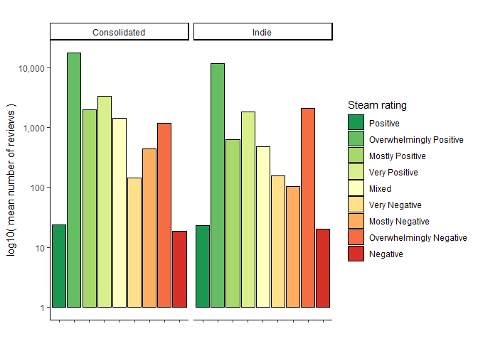<!-- -->

It is interesting that both categories have a similar average number of
reviews in each category regardless if the study is Indie or
Consolidated. Then I don’t expect that the over-representation of Indie
games (two times more than games from consolidated companies) has a
large impact in the distribution of the number of reviews in each rating
category.

Make a graph where it makes sense to customize the alpha transparency.

``` r
steam_games_reduced %>%
  filter(review_category == "top") %>%
  filter(original_price < 200) %>%
  filter(player_count %in% c("OnlySingle", "OnlyMulti")) %>%
  select(dev_stage, player_count, pos_fraction, original_price) %>%
  ggplot(aes(x = original_price, y = pos_fraction, 
             color = dev_stage)) +
  geom_point(alpha = 0.6) +
  theme_classic() +
  scale_x_continuous(labels = dollar)+
  scale_y_continuous(labels = percent)+
  labs(color = "Developer category", 
       y = "Fraction positive reviews", 
       x = "Original price")
```

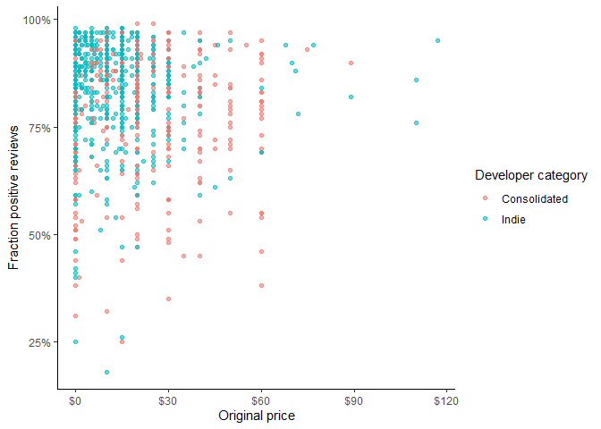<!-- -->

In this plot makes sense to use alpha to visualize overlapping games due
to the discreteness of the x-axis. Since there are some fixed common
prices, games from both developer categories overlap.

Using variables and/or tables you made in one of the “Summarizing”
tasks:

8.  Create a graph that has at least two geom layers.

**For this section I aimed to answer the question:  *Is the proportion
of positive comments associated with the player count of each game?***  
**Note**: *Second barplot has two geom layers*  
In the summarizing section we observed that the number of games for each
player count category has a similar distribution across all Steam
ratings. So in the following plot I visualized the distribution of
positive reviews, accounting for the differences in the number of
reviews for each player count.

``` r
category_colors <- brewer.pal(9, "RdYlGn")[seq(9,1)]

n_single <- steam_games_reduced %>%
  filter(player_count == "OnlySingle") %>%
  nrow()
n_multi <- steam_games_reduced %>%
  filter(player_count == "OnlyMulti") %>%
  nrow()
n_both <- steam_games_reduced %>%
  filter(player_count == "Both") %>%
  nrow()

steam_games_reduced %>%
  filter(player_count != "NoInfo") %>%
  group_by(categorical, player_count) %>%
  summarise(num_games = n()) %>%
  mutate(game_fraction = case_when(
    player_count == "OnlySingle" ~ num_games/n_single,
    player_count == "OnlyMulti" ~ num_games/n_multi,
    player_count == "Both" ~ num_games/n_both
  )) %>%
  ggplot(aes(x = categorical, y = game_fraction, fill = categorical)) +
  geom_bar(stat = "identity", color = "black")+
  scale_y_continuous(labels = percent)+
  scale_fill_manual(values = category_colors) +
  facet_grid(~player_count)  +
  labs(title = "Fraction of games in each Steam rating \nby player count", x = "", 
       y = "", fill = "Steam rating") +
  theme_classic()  +
  theme(axis.text.x = element_blank())
```

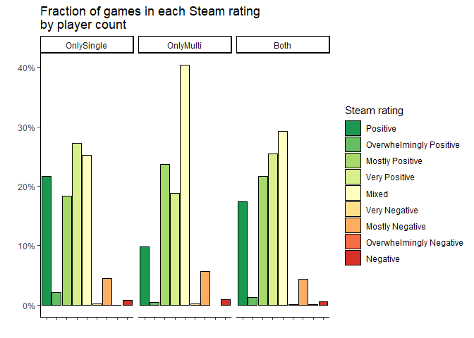<!-- -->

This barplot shows that games entirely multiplayer tend to have a
majority of mixed reviews in comparison to games that provide a single
player option. It is interesting that the proportion of negative reviews
is similar across player count. A simpler visualization between
positive, mixed and negative will allow to make a broader comparison:

``` r
category_colors <- brewer.pal(9, "RdYlGn")[c(9,5,1)]

n_single <- steam_games_reduced %>%
  filter(player_count == "OnlySingle") %>%
  nrow()
n_multi <- steam_games_reduced %>%
  filter(player_count == "OnlyMulti") %>%
  nrow()
n_both <- steam_games_reduced %>%
  filter(player_count == "Both") %>%
  nrow()

steam_games_reduced %>%
  filter(player_count != "NoInfo") %>%
  mutate(categorical = case_when(
    str_detect(categorical, "Positive") ~ "Positive",
    str_detect(categorical, "Negative") ~ "Negative",
    categorical == "Mixed" ~ "Mixed"
  )) %>%
  mutate(categorical = factor(categorical, 
                              levels = c("Positive", "Mixed", "Negative"))) %>%
  group_by(categorical, player_count) %>%
  summarise(num_games = n()) %>%
  mutate(game_fraction = case_when(
    player_count == "OnlySingle" ~ num_games/n_single,
    player_count == "OnlyMulti" ~ num_games/n_multi,
    player_count == "Both" ~ num_games/n_both
  )) %>%
  ggplot(aes(x = categorical, y = game_fraction, fill = categorical)) +
  geom_bar(stat = "identity", color = "black")+
  geom_text(aes(label= paste(round(game_fraction, 2) * 100, "%", sep = "")),
            vjust=1.6,size=3.5) +
  scale_y_continuous(labels = percent)+
  scale_fill_manual(values = category_colors) +
  facet_grid(~player_count)  +
  labs(title = "Fraction of games in aggregated Steam ratings \nby player count", x = "", 
       y = "", fill = "Steam rating") +
  theme_classic()  +
  theme(axis.text.x = element_blank())
```

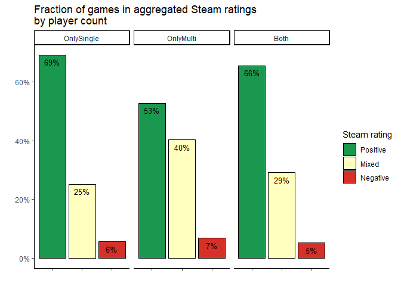<!-- -->

If we aggregate the positive and negative categories, it is clear that
games with a single-player dynamic are better rated than exclusively
multiplayer games.

9.  Create 3 histograms, with each histogram having different sized
    bins. Pick the “best” one and explain why it is the best.

For this question we will visualize the price distribution for the
following question:  
***Do free to play games tend to have better reviews compared to high
price-tag games?***

``` r
# Default
steam_games_reduced %>%
  filter(!is.na(original_price)) %>%
  filter(original_price < 200) %>%
  ggplot(aes(x = original_price)) +
  geom_histogram(bins = 30) +
  theme_classic()
```

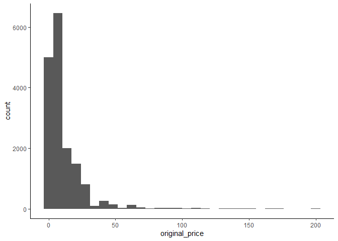<!-- -->

``` r
# Fixing the binwidth
steam_games_reduced %>%
  filter(!is.na(original_price)) %>%
  filter(original_price < 200) %>%
  ggplot(aes(x = original_price)) +
  geom_histogram(binwidth = 10) +
  theme_classic()
```

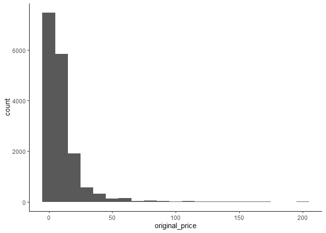<!-- -->

``` r
steam_games_reduced %>%
  filter(!is.na(original_price)) %>%
  filter(original_price < 200) %>%
  mutate(original_price = original_price) %>%
  ggplot(aes(x = original_price + 2)) +
  geom_histogram(binwidth = 2) +
  theme_classic()
```

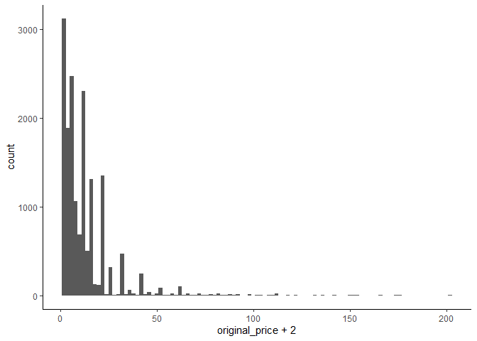<!-- -->

Normally, I would select the binwidth of 10 since it gives a good
summary of the price distribution. However, since I am interested in
evaluating free-to-play games using an effective binwidth of 2 gives me
a better visualization. Specially if I add a constant of 2 so the games
that are at zero have their own bin.

<!----------------------------------------------------------------------------->

### 1.3 (2 points)

Based on the operations that you’ve completed, how much closer are you
to answering your research questions? Think about what aspects of your
research questions remain unclear. Can your research questions be
refined, now that you’ve investigated your data a bit more? Which
research questions are yielding interesting results?

<!------------------------- Write your answer here ---------------------------->

1.  *Is the proportion of positive comments associated with the player
    count of each game?*

    The distribution of positive vs negative reviews seems to be
    slightly biased in favor of games with at least a single-player
    component. While exclusively multi-player games have the highest
    rate of mixed reviews.

2.  *Does any video game genre has more positive comments?*

    So far I haven’t approached this question.

3.  *Is the proportion of positive comments higher for indie vs
    consolidated developers?*

    Indie and consolidated developers seem to have a similar
    representation of games in each Steam rating. Even though there are
    twice as many indie games, seems like this will not influence any
    association between positive fraction of reviews and developer
    category (indie vs consolidated)

4.  *Do free to play games tend to have better reviews compared to high
    price-tag games?*

    I visualized the distribution of game prices, low cost games seem to
    be the most abundant type of games on Steam. Also the scatterplot
    with alpha seems to indicate an association of high price-tag indie
    games and a high fraction of positive reviews.

In general, seems like questions 1 and 3 found some associations between
fraction of positive reviews and player-count/developer-category.
Probably question 2 is harder to tackle than what I originally expected
due to the large number of genres.

<!----------------------------------------------------------------------------->

# Task 2: Tidy your data

In this task, we will do several exercises to reshape our data. The goal
here is to understand how to do this reshaping with the `tidyr` package.

A reminder of the definition of *tidy* data:

- Each row is an **observation**
- Each column is a **variable**
- Each cell is a **value**

### 2.1 (2 points)

Based on the definition above, can you identify if your data is tidy or
untidy? Go through all your columns, or if you have \>8 variables, just
pick 8, and explain whether the data is untidy or tidy.

<!--------------------------- Start your work below --------------------------->

``` r
head(steam_games_reduced[, c(1,8,10:15)])
```

    ## # A tibble: 6 × 8
    ##      id original_price pos_fraction total_reviews pos_r…¹ online playe…² revie…³
    ##   <dbl>          <dbl>        <dbl>         <dbl>   <dbl> <lgl>  <fct>   <fct>  
    ## 1     1           20.0         0.92         42550   39146 FALSE  Both    top    
    ## 2     2           30.0         0.49        836608  409938 TRUE   OnlyMu… top    
    ## 3     3           40.0         0.71          7030    4992 TRUE   Both    top    
    ## 4     4           45.0         0.61        167115  101941 TRUE   OnlyMu… top    
    ## 5     5            0           0.74         11481    8496 TRUE   OnlyMu… top    
    ## 6     7           60.0         0.92          9645    8874 TRUE   OnlySi… top    
    ## # … with abbreviated variable names ¹​pos_reviews, ²​player_count,
    ## #   ³​review_category

My data is already tidy because each row is a different game

<!----------------------------------------------------------------------------->

### 2.2 (4 points)

Now, if your data is tidy, untidy it! Then, tidy it back to it’s
original state.

If your data is untidy, then tidy it! Then, untidy it back to it’s
original state.

Be sure to explain your reasoning for this task. Show us the “before”
and “after”.

<!--------------------------- Start your work below --------------------------->

``` r
untidy_result <- spread(steam_games_reduced, 
                        key = player_count, value = pos_fraction) %>%
  select(id, NoInfo, OnlySingle, OnlyMulti,Both) 
untidy_result %>%
  head()
```

    ## # A tibble: 6 × 5
    ##      id NoInfo OnlySingle OnlyMulti  Both
    ##   <dbl>  <dbl>      <dbl>     <dbl> <dbl>
    ## 1     1     NA      NA        NA     0.92
    ## 2     2     NA      NA         0.49 NA   
    ## 3     3     NA      NA        NA     0.71
    ## 4     4     NA      NA         0.61 NA   
    ## 5     5     NA      NA         0.74 NA   
    ## 6     7     NA       0.92     NA    NA

In this scenario I assigned the positive fraction of reviews to the
player count variable. In this case we have two variables mixed and
multiple values of the same variable take several columns.

``` r
tidy_result <- untidy_result %>%
  gather(key = player_count, value = pos_fraction, -id) %>%
  arrange(id) %>%
  na.omit()
tidy_result %>%
  head()
```

    ## # A tibble: 6 × 3
    ##      id player_count pos_fraction
    ##   <dbl> <chr>               <dbl>
    ## 1     1 Both                 0.92
    ## 2     2 OnlyMulti            0.49
    ## 3     3 Both                 0.71
    ## 4     4 OnlyMulti            0.61
    ## 5     5 OnlyMulti            0.74
    ## 6     7 OnlySingle           0.92

Here I used the function gather to create again the two corresponding
variables while conserving the ID to merge the data back with the
original table.

<!----------------------------------------------------------------------------->

### 2.3 (4 points)

Now, you should be more familiar with your data, and also have made
progress in answering your research questions. Based on your interest,
and your analyses, pick 2 of the 4 research questions to continue your
analysis in the remaining tasks:

<!-------------------------- Start your work below ---------------------------->

1.  *Is the proportion of positive comments higher for indie vs
    consolidated developers?*
2.  *Is the proportion of positive comments associated with the player
    count of each game?*

<!----------------------------------------------------------------------------->

Explain your decision for choosing the above two research questions.

<!--------------------------- Start your work below --------------------------->

The first question just needs one more step to visualize the
relationship between positive fraction of reviews and developer
category.

The second question was almost solved in the previous steps, I would
like to make an alternative comparison of the distribution of positive
reviews. Instead of eyeballing the differences between categories.

<!----------------------------------------------------------------------------->

Now, try to choose a version of your data that you think will be
appropriate to answer these 2 questions. Use between 4 and 8 functions
that we’ve covered so far (i.e. by filtering, cleaning, tidy’ing,
dropping irrelevant columns, etc.).

(If it makes more sense, then you can make/pick two versions of your
data, one for each research question.)

<!--------------------------- Start your work below --------------------------->

***Is the proportion of positive comments higher for indie vs
consolidated developers?***

I compared consolidated vs Indie devolpers using the fraction of games
in each Steam rating. Since the Indie category has twice as many games
as the consolidated, it was important to scale by the total number of
games in each developer category.

``` r
category_colors <- brewer.pal(9, "RdYlGn")[seq(9,1)]  
n_indie <- steam_games_reduced %>%   
  filter(dev_stage == "Indie") %>%   
  nrow() 
n_cons <- steam_games_reduced %>%   
  filter(dev_stage == "Consolidated") %>%   
  nrow()    
steam_games_reduced %>%   
  filter(!is.na(dev_stage)) %>%   
  group_by(dev_stage, categorical) %>%   
  summarise(n_games = n()) %>%   
  mutate(game_fraction = ifelse(dev_stage == "Indie",
                                n_games/n_indie, n_games/n_cons)) %>%   
  ggplot(aes(x = categorical, y = game_fraction, fill = categorical)) +   
  geom_bar(stat = "identity", color = "black")+   
  scale_y_continuous(labels = percent)+   
  scale_fill_manual(values = category_colors) +   
  facet_grid(~dev_stage)  +   
  labs(title = "Fraction of games in each Steam rating \nby developer category", 
       x = "", y = "", fill = "Steam rating") +   
  theme_classic()  +  
  theme(axis.text.x = element_blank())
```

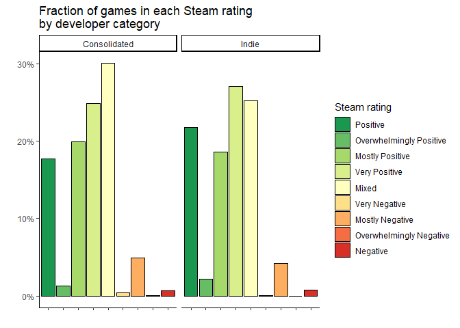<!-- -->

This visualization shows that Indie developers have a higher fraction of
games in the positive categories in comparison to consolidated
developers. Although the differences are small, it is still clear a
trend for games of consolidated developers to have a mixed rating while
Indie developers’ games were rated with more positive reviews than games
from consolidated developers.  
  
To test if this observation is true, I compared the mean fraction of
positive reviews of games made by indie vs consolidated developers using
a t-test:

``` r
my_comparisons <- list( c("Consolidated", "Indie"))
steam_games_reduced  %>%   
  filter(!is.na(dev_stage))  %>% 
  ggplot(aes(x = dev_stage, y = pos_fraction, fill = dev_stage)) + 
  geom_violin() + 
  stat_summary(fun= mean, geom="point", size=2)+
  stat_compare_means(aes(label = after_stat(p.signif)),
                     comparisons = my_comparisons, 
                     method = "t.test", vjust = 0.6) +
  theme_classic() +
  scale_y_continuous(labels = percent)+   
  labs(fill = "Developer category", x = "", y = "Positive reviews by game")
```

    ## [1] TRUE

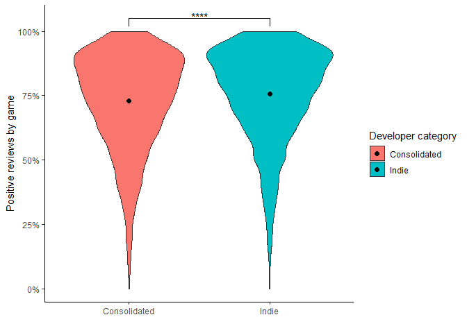<!-- -->

The black dot represents the mean of both distributions. The result from
the t-test rejects the null hypothesis that mean positive fraction is
the same between consolidated and indie games (*pval* \<= 0.0001). Thus
there is a small, but significant, preference of good reviews for indie
games.

***Is the proportion of positive comments associated with the player
count of each game?***

The differences between Steam ratings across player count seem a bit
more drastic than the differences between consolidated and indie games.
Thus I made a comparison of the distribution of positive review fraction
using boxplots:

``` r
my_comparisons <- list( c("OnlySingle", "OnlyMulti"), c("Both", "OnlyMulti"))
steam_games_reduced %>%
  filter(player_count != "NoInfo") %>% 
  ggplot(aes(x = player_count, y = pos_fraction, fill = player_count)) + 
  geom_boxplot() +
  stat_compare_means(aes(label = after_stat(p.signif)),
                     comparisons = my_comparisons, 
                     method = "t.test", vjust = 0.6) +
  theme_classic() +
  scale_y_continuous(labels = percent, breaks = seq(0,1,0.25))+   
  labs(fill = "Player count", x = "", y = "Positive reviews by game")
```

    ## [1] TRUE

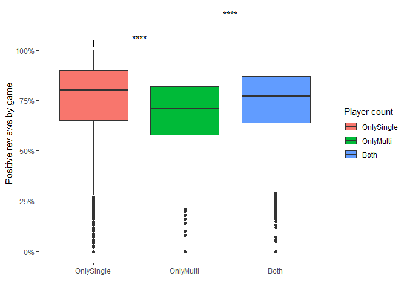<!-- -->

I performed a t-test comparing the mean fraction of positive reviews for
games across multiple player counts. Games exclusively multiplayer had
significantly worse reviews in comparison to games exclusively single
player or with both player counts (*p value* \<= 0.0001)

# Task 3: Modelling

## 3.0 (no points)

Pick a research question from 1.2, and pick a variable of interest
(we’ll call it “Y”) that’s relevant to the research question. Indicate
these.

<!-------------------------- Start your work below ---------------------------->

**Research Question**: *Do indie games have a positive linear
relationship between price and fraction of positive reviews?*

This question was modified based on the results from the visualization
step. Indie games with elevated price-tags had a high fraction of
positive reviews. I consider it would be good to look into this possible
relationship.

This observation was made for games with a high number of reviews, so I
will first explore how the relationship looks across different number of
reviews.

**Variable of interest**: original price

<!----------------------------------------------------------------------------->

## 3.1 (3 points)

Fit a model or run a hypothesis test that provides insight on this
variable with respect to the research question. Store the model object
as a variable, and print its output to screen. We’ll omit having to
justify your choice, because we don’t expect you to know about model
specifics in STAT 545.

- **Note**: It’s OK if you don’t know how these models/tests work. Here
  are some examples of things you can do here, but the sky’s the limit.

  - You could fit a model that makes predictions on Y using another
    variable, by using the `lm()` function.
  - You could test whether the mean of Y equals 0 using `t.test()`, or
    maybe the mean across two groups are different using `t.test()`, or
    maybe the mean across multiple groups are different using `anova()`
    (you may have to pivot your data for the latter two).
  - You could use `lm()` to test for significance of regression
    coefficients.

<!-------------------------- Start your work below ---------------------------->

``` r
steam_games_reduced %>%
  filter(original_price < 200) %>%
  na.omit() %>%
  ggplot(aes(x = original_price +2, y = pos_fraction))+
  geom_point() + 
  geom_smooth(method = lm)+
  theme_classic() + 
  facet_grid(dev_stage ~ review_category)+
  scale_y_continuous(labels = percent, breaks = seq(0,1,0.25))+   
  scale_x_continuous(labels = dollar, trans = "log2") +
  labs(x = "log2( Original price + 2)", y = "Positive reviews by game")
```

    ## `geom_smooth()` using formula = 'y ~ x'

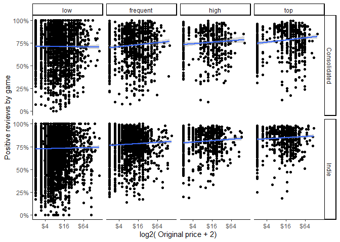<!-- -->

Both developer categories seem to have a positive relationship between
price and positive reviews by game. So I will focus on games with the
highest number of ratings

``` r
model_data <- steam_games_reduced %>%
  filter(original_price < 200) %>%
  filter(review_category == "top") %>%
  filter(dev_stage != "NoInfo") %>%
  select(dev_stage, original_price, pos_fraction) %>%
  mutate(original_price = log2(original_price + 2))

linear_model <- lm(pos_fraction ~ original_price + dev_stage, data = model_data)
```

<!----------------------------------------------------------------------------->

## 3.2 (3 points)

Produce something relevant from your fitted model: either predictions on
Y, or a single value like a regression coefficient or a p-value.

- Be sure to indicate in writing what you chose to produce.
- Your code should either output a tibble (in which case you should
  indicate the column that contains the thing you’re looking for), or
  the thing you’re looking for itself.
- Obtain your results using the `broom` package if possible. If your
  model is not compatible with the broom function you’re needing, then
  you can obtain your results by some other means, but first indicate
  which broom function is not compatible.

<!-------------------------- Start your work below ---------------------------->

``` r
# Tidy the linear model
tidy_result <- tidy(linear_model)

# Extract R-squared and other model-level statistics
glance_result <- glance(linear_model)

# Print the tidy coefficients
print(tidy_result)
```

    ## # A tibble: 3 × 5
    ##   term           estimate std.error statistic  p.value
    ##   <chr>             <dbl>     <dbl>     <dbl>    <dbl>
    ## 1 (Intercept)     0.746     0.00960     77.7  0       
    ## 2 original_price  0.00870   0.00214      4.07 4.86e- 5
    ## 3 dev_stageIndie  0.0682    0.00654     10.4  9.84e-25

``` r
# Print the R-squared and other model-level statistics
print(glance_result)
```

    ## # A tibble: 1 × 12
    ##   r.squared adj.r.sq…¹ sigma stati…²  p.value    df logLik    AIC    BIC devia…³
    ##       <dbl>      <dbl> <dbl>   <dbl>    <dbl> <dbl>  <dbl>  <dbl>  <dbl>   <dbl>
    ## 1    0.0633     0.0622 0.132    57.1 1.04e-24     2  1028. -2048. -2026.    29.4
    ## # … with 2 more variables: df.residual <int>, nobs <int>, and abbreviated
    ## #   variable names ¹​adj.r.squared, ²​statistic, ³​deviance

`estimate` interpretation:

- `Intercept`: The intercept represents the fraction of positive reviews
  when original price is zero and `dev_stage` is equal to
  “Consolidated”. The 0.746 can be interpreted as the baseline positive
  review fraction.

- `original_price`: The coefficient for `original_price` is 0.008703. It
  represents the change in the fraction of positive reviews when the
  original price increased by \$2 dollars (due to log2 scale). This
  suggests that as the price increases (in the transformed scale), the
  positive review fraction tends to increase.

- `dev_stageIndie`: The coefficient for `dev_stageIndie` is 0.068186. It
  represents the difference in fraction of positive reviews between the
  “Indie” category and the reference category “Consolidated.” So, being
  in the “Indie” category is associated with an increase of 6.8% on
  positive reviews compared to “Consolidated.”

`p.value` interpretation:

The p-values associated with the coefficients are very low, indicating
that both price and developer category have a statistically significant
effect on the fraction of positive reviews.

`r.squared` interpretation:

The adjusted R-squared value is 0.06222, indicating that the model
explains approximately 6.22% of the variance in the fraction of positive
reviews

**Model interpretation**

Overall, the model suggests that both `original_price` and `dev_stage`
are significant predictors of `pos_fraction`, and games developed by
“Indie” developers tend to receive more positive reviews. However, the
model’s R-squared value indicates that a substantial portion of the
variation in the fraction of positive reviews remains unexplained,
suggesting that other factors may also influence positive reviews. This
model is limited to explaining variability in games with the highest
number of reviews (\>90th percentile), however both developer categories
have similar representation in terms of number of games.

<!----------------------------------------------------------------------------->

# Task 4: Reading and writing data

Get set up for this exercise by making a folder called `output` in the
top level of your project folder / repository. You’ll be saving things
there.

## 4.1 (3 points)

Take a summary table that you made from Task 1, and write it as a csv
file in your `output` folder. Use the `here::here()` function.

- **Robustness criteria**: You should be able to move your Mini Project
  repository / project folder to some other location on your computer,
  or move this very Rmd file to another location within your project
  repository / folder, and your code should still work.
- **Reproducibility criteria**: You should be able to delete the csv
  file, and remake it simply by knitting this Rmd file.

<!-------------------------- Start your work below ---------------------------->

``` r
write.csv(steam_games_reduced, 
          file = "~/Github/mda-mtello22/output/steam_games_reduced.csv",
          col.names = TRUE, row.names = FALSE)
```

    ## Warning in write.csv(steam_games_reduced, file =
    ## "~/Github/mda-mtello22/output/steam_games_reduced.csv", : attempt to set
    ## 'col.names' ignored

<!----------------------------------------------------------------------------->

## 4.2 (3 points)

Write your model object from Task 3 to an R binary file (an RDS), and
load it again. Be sure to save the binary file in your `output` folder.
Use the functions `saveRDS()` and `readRDS()`.

- The same robustness and reproducibility criteria as in 4.1 apply here.

<!-------------------------- Start your work below ---------------------------->

``` r
saveRDS(object = linear_model, 
        file = "~/Github/mda-mtello22/output/steam_games_lm.RDS")
rm(linear_model)
exists(x = "linear_model")
```

    ## [1] FALSE

``` r
linear_model <- readRDS(file = "~/Github/mda-mtello22/output/steam_games_lm.RDS")
exists(x = "linear_model")
```

    ## [1] TRUE

<!----------------------------------------------------------------------------->

# Overall Reproducibility/Cleanliness/Coherence Checklist

Here are the criteria we’re looking for.

## Coherence (0.5 points)

The document should read sensibly from top to bottom, with no major
continuity errors.

The README file should still satisfy the criteria from the last
milestone, i.e. it has been updated to match the changes to the
repository made in this milestone.

## File and folder structure (1 points)

You should have at least three folders in the top level of your
repository: one for each milestone, and one output folder. If there are
any other folders, these are explained in the main README.

Each milestone document is contained in its respective folder, and
nowhere else.

Every level-1 folder (that is, the ones stored in the top level, like
“Milestone1” and “output”) has a `README` file, explaining in a sentence
or two what is in the folder, in plain language (it’s enough to say
something like “This folder contains the source for Milestone 1”).

## Output (1 point)

All output is recent and relevant:

- All Rmd files have been `knit`ted to their output md files.
- All knitted md files are viewable without errors on Github. Examples
  of errors: Missing plots, “Sorry about that, but we can’t show files
  that are this big right now” messages, error messages from broken R
  code
- All of these output files are up-to-date – that is, they haven’t
  fallen behind after the source (Rmd) files have been updated.
- There should be no relic output files. For example, if you were
  knitting an Rmd to html, but then changed the output to be only a
  markdown file, then the html file is a relic and should be deleted.

Our recommendation: delete all output files, and re-knit each
milestone’s Rmd file, so that everything is up to date and relevant.

## Tagged release (0.5 point)

You’ve tagged a release for Milestone 2.

### Attribution

Thanks to Victor Yuan for mostly putting this together.
